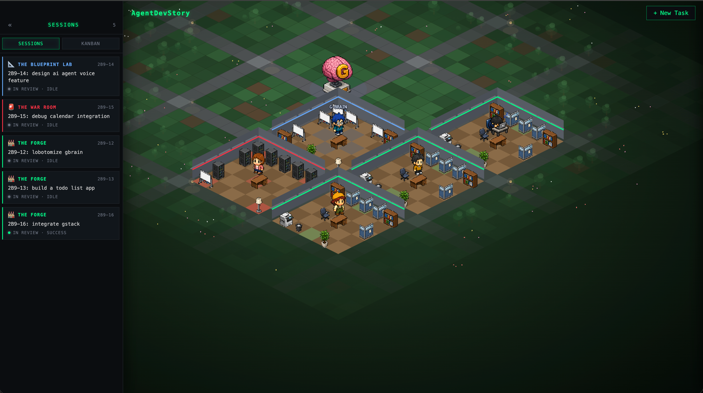

# AgentDevStory / AgentOffice

> **Demo:** https://screen.studio/share/2JABmEkb



Isometric visual canvas for monitoring multiple long-running Claude Code sessions as a sprawling office floor. Each Linear issue spawns a room with a sprite that reacts to the live session state (`idle` / `typing` / `thinking` / `executing` / `success` / `error` / `dormant`). The room's archetype (Forge / War Room / Blueprint Lab / Lounge) is picked from the issue's labels.

## Stack

- **Phaser 3** — iso canvas, depth-banded rendering (`floor → wall → asset → sprite`), per-room sort, pinch-to-zoom, click-drag pan
- **Vite** — dev server + bundler for the client
- **Node + Express + ws + tsx** — backend at `:4317` that spawns `claude` subprocesses, parses `--output-format stream-json`, and pipes events to the canvas over WebSocket
- **Linear API** — source of truth for tasks; agent state changes get mirrored back as comments and state transitions
- **G-Brain** — local knowledge layer; each agent writes its workspace into the shared graph so neighbouring rooms can semantic-search prior work

## Run

```bash
npm install                 # client deps
npm --prefix server install # server deps
npm run dev:all             # vite at :5173 + backend at :4317
```

The backend needs a `.env` (see `server/src/index.ts` for the full list) — minimum: `LINEAR_API_KEY`, `LINEAR_TEAM_ID`, plus your `claude` CLI on PATH.

## Project layout

```
src/
  main.js                     Phaser bootstrap + UI init + WebSocket connect
  ui.js                       Left sessions panel, terminal slide-over, new-task modal
  backend.js                  WebSocket client + room-sync cache
  api.js                      REST glue
  styles.css                  CRT terminal aesthetic, task cards, integrations
  config/
    Assets.js                 Asset registry + per-role scale/walkable props
    IsoConfig.js              ISO constants, focus offsets, world origin
    RoomTypes.js              Room archetype metadata + keyword classifier
  scenes/
    AgencyFloorScene.js       Scene, depth bands, camera pan/zoom, click-vs-drag
  util/
    spiral.js                 Clockwise spiral macro-coord generator
    persistence.js            localStorage round-trip (fallback when no backend)
    chromaKey.js              Legacy white-bg → transparent (unused with new art)
  world/
    Backdrop.js               Agency mega-floor: grass + paths + trees + lamps + fountain
    Room.js                   5×5 spawn (floors, walls, asset matrix, walkability)
    RoomLayouts.js            Per-type 5×5 grids (back→front, role names or null)
    Agent.js                  Sprite state machine + pathfinding wander + walk frames
server/
  src/
    index.ts                  Express + ws + REST + Linear sync + agent lifecycle
    agent-manager.ts          Spawns claude, parses stream-json events into AgentStates
    linear.ts                 GraphQL client, issue → room mapping
    gbrain.ts                 Knowledge-layer sync on agent success
    types.ts                  Shared API contract (AgentState, Room, etc.)
assets/
  office-items/               64×64 iso furniture sprites (16 roles)
  characters/character-XX/    10 chars × 6 emotion poses × 4 directions + walk frames
  gbrain/                     The big pink brain at the spawn hub
```

## State machine

```
Linear         backend AgentState       sprite SM            pose
─────────      ──────────────────       ──────────────       ─────────────
Todo           idle                     SITTING_IDLE         idle
In Progress    typing                   SITTING_TYPING       typing
               thinking                 SITTING_THINKING     thinking
               executing  (tool_use)    SITTING_EXECUTING    typing
               (server walk hint)       WALKING              walk-1/walk-2
In Review      success                  REACTING_CHEER       cheer  (5s)
               error                    REACTING_SURPRISED   surprised (5s)
               dormant                  SLEEPING             sleep
```

When `claude -p <prompt> --output-format stream-json --verbose` emits a `tool_use` event, the backend flips state to `executing`; on `tool_result` it flips back to `thinking`. The sprite picks up state changes via the websocket and routes them through `setAgentState(externalState)` in `src/world/Agent.js`.

## Controls

- **Click** a room (any floor tile) — auto-focus camera, slide-over terminal opens
- **Click-drag** — pan the camera
- **WASD / arrow keys** — keyboard pan
- **Two-finger pinch** (trackpad) or **Ctrl+wheel** (mouse) — zoom (0.4× – 2.5×)
- **`! cmd`** in the terminal — virtual shell (`! ls`, `! cat <file>`, `! pwd`, `! help`)
- Plain Enter in the terminal — sends to the active Claude session

## Roadmap

- Walking-agent paths between rooms (cross-room visits — currently sprites only walk within their own room)
- gbrain semantic search surfaced as a side panel
- Multi-user — second sprite + named ownership per room
- Camera bounding-box clamp so the world doesn't pan off into the void
